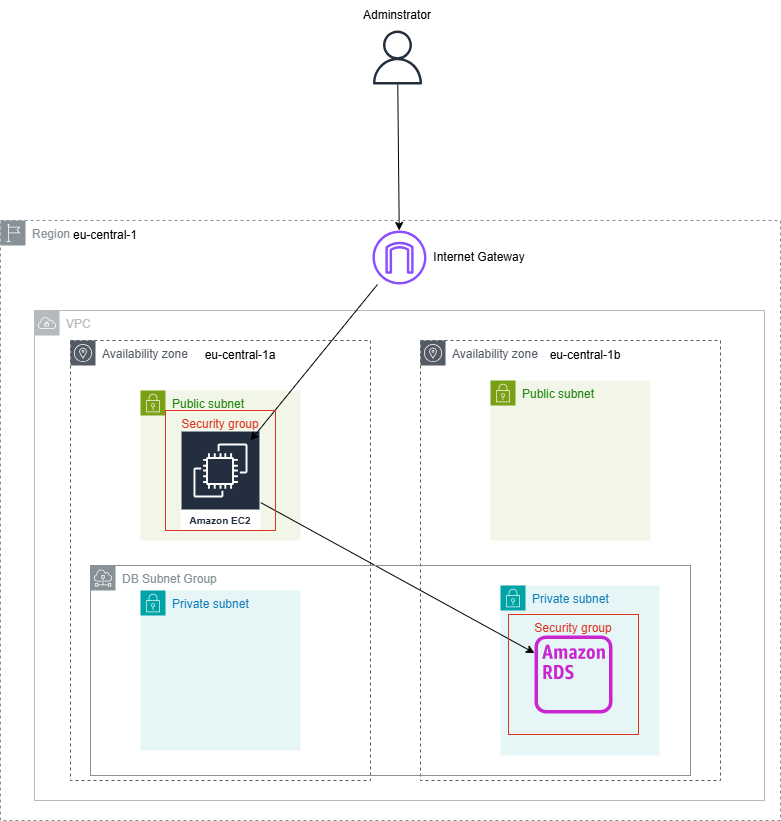
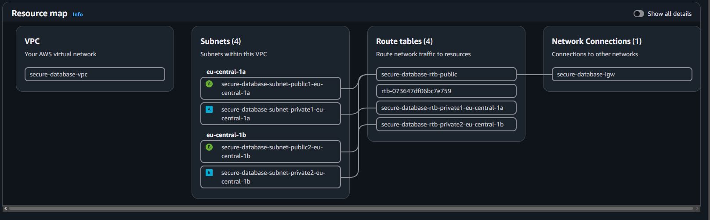
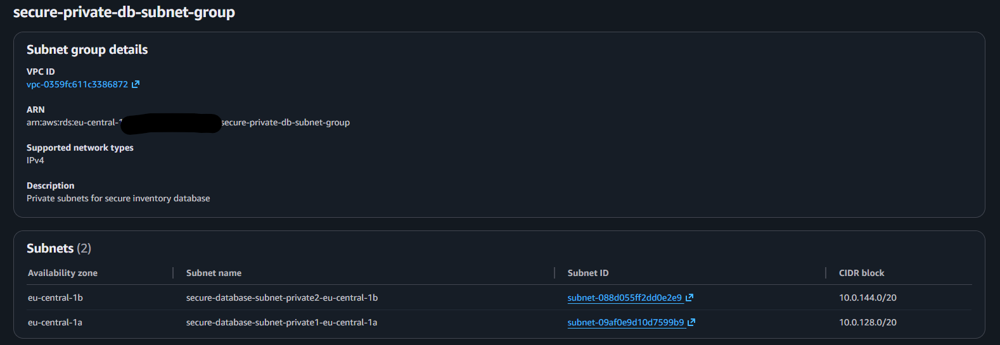
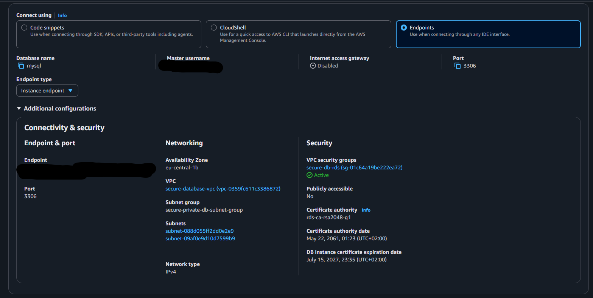
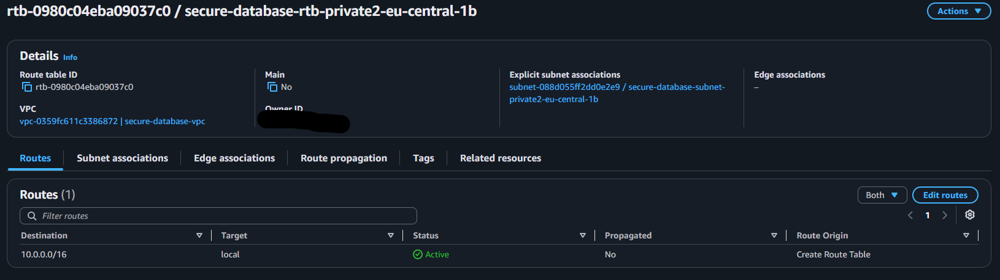
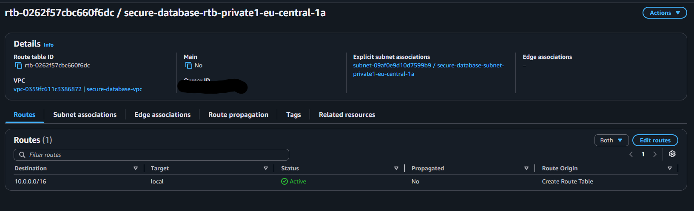
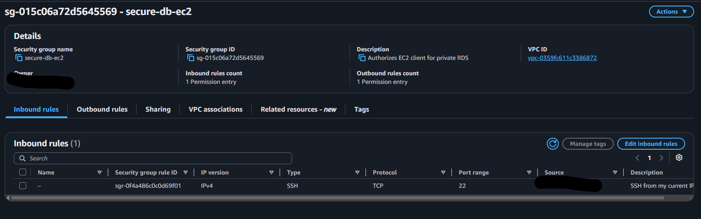
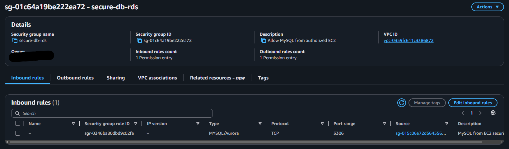
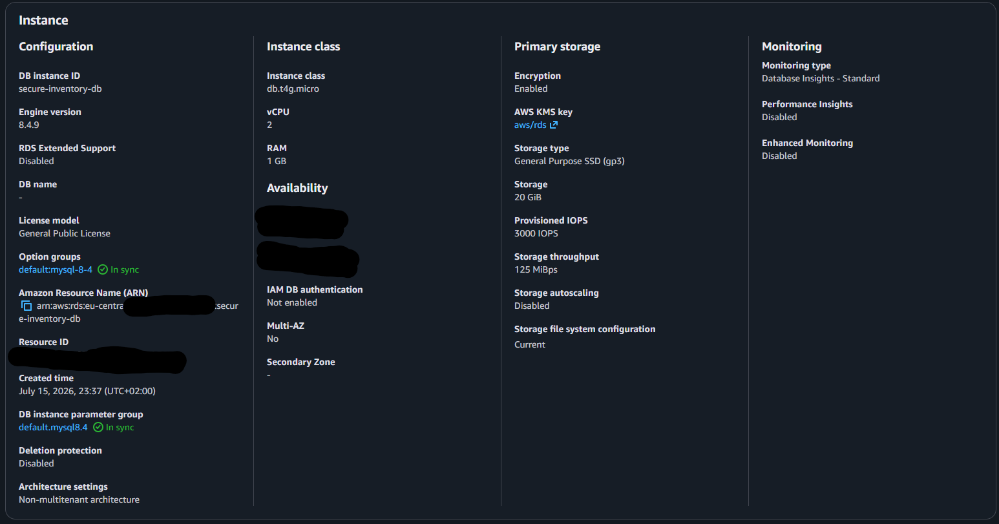
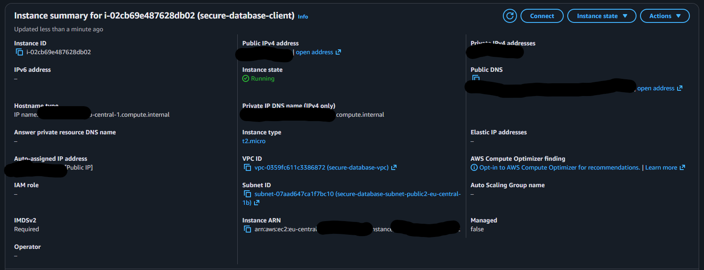

# Secure Private MySQL Database on AWS

A networking and database security project demonstrating how to deploy Amazon RDS for MySQL inside private VPC subnets and allow database connections only from an authorized Amazon EC2 instance.

The RDS database was not exposed to the public internet. Access to MySQL port 3306 was controlled through Security Group referencing, while administrative SSH access to EC2 was restricted to a single IP address.

A simple Python program was transferred to EC2 and used to connect to RDS, create an inventory database, insert sample records and retrieve the stored results.

## Project Overview

The purpose of this project was to practise secure AWS network design and managed relational database deployment.

Instead of making the database publicly accessible from my personal computer, I created a controlled architecture where:

1. An administrator connects to an EC2 instance using SSH.
2. EC2 runs inside a public subnet.
3. Amazon RDS runs inside the private database tier.
4. RDS accepts MySQL traffic only from the EC2 Security Group.
5. A Python program on EC2 connects to the private database.
6. The database stores and returns sample inventory records.

The project focuses on VPC networking, private subnet isolation, Security Group relationships, RDS configuration, Python database connectivity and basic SQL operations.

## Architecture

### Connection Flow

The administrator connects to the EC2 instance through the Internet Gateway using SSH on port 22.

The SSH rule is restricted to one IP address using a `/32` source. The EC2 instance is placed in a public subnet so it can be used as an authorized database client.

The Python program running on EC2 connects to Amazon RDS using MySQL port 3306.

RDS is placed in private subnets and has public accessibility disabled. Its Security Group accepts port 3306 only when the source is the EC2 Security Group.

There is no direct connection from the internet to the database.

## AWS Services Used

| AWS service | Purpose |
| --- | --- |
| Amazon VPC | Provides the isolated network and separates public and private resources |
| Public subnets | Provide network placement for the EC2 administration instance |
| Private subnets | Provide isolated network placement for Amazon RDS |
| Internet Gateway | Allows controlled SSH access to the EC2 instance |
| Route tables | Separate public internet routing from local-only private routing |
| Amazon EC2 | Runs the Python database demonstration |
| Amazon RDS for MySQL | Hosts the managed relational database |
| Security Groups | Control SSH and MySQL network access |
| Amazon EBS | Provides the EC2 instance root volume |

## Network Design

The VPC was deployed in the `eu-central-1` AWS Region and spans two Availability Zones.

The network contains:

- Two public subnets
- Two private database subnets
- One Internet Gateway
- One public route table
- Two private route tables
- One EC2 instance
- One Single-AZ RDS MySQL instance
- One RDS DB subnet group

The second public subnet is unused in the current demonstration but remains part of the two-Availability-Zone VPC design.

### Public Subnets

The public subnets use a route table containing a default route to the Internet Gateway.

The EC2 instance is located in the first public subnet and receives a temporary public IPv4 address for SSH access.

### Private Subnets

Each private database subnet has only the local VPC route.

The private route tables do not contain:

- An Internet Gateway route
- A NAT Gateway route
- A public default route

This prevents the RDS database tier from having a direct path to or from the public internet.

### DB Subnet Group

The RDS DB subnet group contains one private subnet from each Availability Zone.

Although this demonstration uses one Single-AZ database instance, the subnet group provides RDS with private subnet coverage across two Availability Zones.

## Security Group Design

Two separate Security Groups were created.

### EC2 Security Group

The EC2 Security Group permits:

- Protocol: TCP
- Port: 22
- Source: Administrator IP address using `/32`

SSH was not opened to `0.0.0.0/0`.

This limits administrative access to one network address instead of allowing SSH attempts from the entire internet.

### RDS Security Group

The RDS Security Group permits:

- Protocol: TCP
- Port: 3306
- Source: EC2 Security Group

The source is a Security Group reference rather than a public IP address or broad CIDR range.

This means the database accepts MySQL connections from resources carrying the authorized EC2 Security Group. It does not accept direct MySQL connections from the public internet.

## RDS Security Configuration

The RDS MySQL instance was configured with:

- Public accessibility disabled
- Private DB subnet group
- Storage encryption enabled
- Single-AZ deployment
- MySQL port 3306
- Dedicated RDS Security Group
- Password authentication
- Minimal development storage
- No public database rule
- No Multi-AZ standby
- No read replica

I did not store database credentials in GitHub or coded them in the Python program.

## Python Inventory Demonstration

The project includes a small Python script named `inventory_demo.py`.

The program was uploaded from my computer to the EC2 instance using SCP and then executed inside Amazon Linux.

The script:

1. Requests the RDS endpoint
2. Requests the MySQL username
3. Requests the password securely without displaying it
4. Connects to RDS on port 3306
5. Creates `inventory_db` if it does not exist
6. Creates the `purchases` table
7. Inserts four sample records
8. Retrieves the records
9. Displays them in a formatted terminal table
10. Closes the database connection

The password is requested at runtime and is never stored in the script.

## Database Structure

The demonstration database is named:

`inventory_db`

The table is named:

`purchases`

The table contains:

| Column | Purpose |
| --- | --- |
| `id` | Automatically generated primary key |
| `product_name` | Name of the purchased product |
| `quantity` | Number of products purchased |
| `buyer_name` | Name of the sample buyer |
| `created_at` | Automatic record creation date and time |

Example products include a wireless mouse, USB-C cable, laptop stand and mechanical keyboard.

The buyer records are fictional demonstration data.

## Repository Structure

### `scripts/`

Contains the Python program executed on EC2.

### `sql/`

Contains the SQL schema and sample-data statements used by the demonstration.

### `docs/`

Contains the architecture diagram and deployment instructions.

### `screenshots/`

Contains evidence of the AWS configuration, security controls and successful database connection.

### `requirements.txt`

Lists the Python MySQL connector dependency.

### `.gitignore`

Prevents private keys, environment files, Python cache files and editor-specific files from being committed.

## Deployment Evidence

### VPC Resource Map

The VPC resource map shows the public and private subnets distributed across two Availability Zones.

### Private RDS Subnet Group

The DB subnet group contains the two private subnets in separate Availability Zones.

### Private RDS Connectivity

The database configuration shows that public accessibility is disabled and that RDS uses the private subnet group and dedicated RDS Security Group.

### Private Route Tables

Both private subnet route tables contain only the local VPC route. Neither private subnet has an Internet Gateway or NAT Gateway route.

### EC2 Security Group

SSH access to EC2 is restricted to one administrator IP address using a `/32` rule.

### RDS Security Group

The database accepts MySQL traffic on port 3306 only from the EC2 Security Group.

### Successful Python Connection

The Python program successfully connected from EC2 to the private RDS database and returned four inventory records.

### Encrypted RDS Configuration

The database configuration confirms the selected MySQL, storage and encryption settings.

### Authorized EC2 Client

The EC2 instance was deployed inside the intended VPC and public subnet with the dedicated EC2 Security Group.

## Security Decisions

The following controls were implemented:

- RDS was not publicly accessible
- RDS was placed in private subnets
- Private subnets had no internet route
- No NAT Gateway was created
- Storage encryption was enabled
- MySQL was allowed only from the EC2 Security Group
- SSH was restricted to one `/32` IP address
- The database password was not hardcoded
- The SSH private key was excluded from GitHub
- The RDS endpoint was not treated as authentication
- Separate Security Groups were used for EC2 and RDS
- No inbound database rule used `0.0.0.0/0`

## Why Security Group Referencing Was Used

The RDS inbound rule references the EC2 Security Group rather than the EC2 public IP address.

The public IPv4 address is used only for the administrator-to-EC2 SSH connection. Communication between EC2 and RDS uses private VPC networking.

Security Group referencing makes the rule based on the identity of the authorized AWS resource rather than a changing public IP address.

## Challenges and Solutions

### Windows rejected the SSH private key

Windows OpenSSH initially rejected the `.pem` file because it inherited permissions that allowed other Windows user groups to read it.

I removed the inherited permissions and granted read access only to my Windows user. After correcting the file permissions, SCP and SSH accepted the key.

### Maintaining private database access

The database needed to remain private while still allowing the Python program to connect.

I solved this by placing EC2 and RDS in the same VPC and setting the RDS inbound source to the EC2 Security Group.

### Organizing private subnets

RDS required a DB subnet group containing subnets in two Availability Zones.

I created two private subnets, associated them with local-only route tables and added both to the RDS DB subnet group.

## What I Learned

This project helped me practise:

- Creating a custom AWS VPC
- Designing public and private subnet tiers
- Understanding route-table behaviour
- Using multiple Availability Zones
- Creating an RDS DB subnet group
- Deploying a private RDS MySQL database
- Connecting EC2 to RDS
- Referencing one Security Group from another
- Restricting SSH access
- Using Python with MySQL
- Creating tables and inserting SQL records
- Transferring files with SCP
- Connecting to Amazon Linux using SSH
- Troubleshooting Windows private-key permissions
- Reviewing AWS resources for potential costs
- Cleaning up cloud infrastructure safely

## Cost Management and Cleanup

The AWS console displayed an estimated monthly cost for running the RDS configuration continuously.

I used this project only long enough to:

- Create the resources
- Verify the network restrictions
- Run the Python demonstration
- Capture deployment evidence

After testing, the following resources were removed:

The source code, architecture diagram and screenshots preserve the project after the paid AWS resources are removed.

## Future Improvements

Possible improvements include:

- Store credentials in AWS Secrets Manager
- Require TLS explicitly for MySQL connections
- Replace direct SSH with AWS Systems Manager Session Manager
- Add IAM database authentication
- Run a small private application on EC2
- Add Multi-AZ RDS for production availability
- Add database monitoring and alarms
- Define the infrastructure using Terraform or AWS CloudFormation
- Add automated deployment and cleanup

I excluded these improvements from the first version to keep the project focused on private networking and Security Group-controlled database access.

